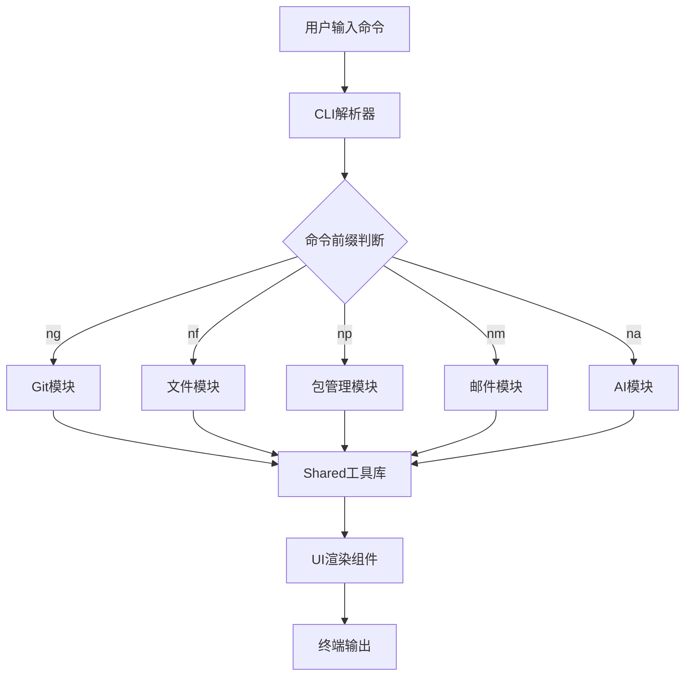

# 项目概述

<cite>
**本文档引用的文件**  
- [README.md](file://README.md)
- [package.json](file://package.json)
- [pnpm-workspace.yaml](file://pnpm-workspace.yaml)
- [packages/git/src/index.ts](file://packages/git/src/index.ts)
- [packages/file/src/index.ts](file://packages/file/src/index.ts)
- [packages/package/src/index.ts](file://packages/package/src/index.ts)
- [packages/ai/src/index.ts](file://packages/ai/src/index.ts)
- [packages/mail/src/index.ts](file://packages/mail/src/index.ts)
- [packages/shared/src/index.ts](file://packages/shared/src/index.ts)
- [packages/shared/src/utils/command.ts](file://packages/shared/src/utils/command.ts)
- [packages/shared/src/utils/git-handle/index.ts](file://packages/shared/src/utils/git-handle/index.ts)
- [packages/ui/src/index.ts](file://packages/ui/src/index.ts)
</cite>

## 目录
1. [简介](#简介)
2. [项目结构](#项目结构)
3. [核心功能模块](#核心功能模块)
4. [架构设计](#架构设计)
5. [命令接口与用户交互](#命令接口与用户交互)
6. [组件交互流程](#组件交互流程)
7. [共享工具与UI渲染](#共享工具与ui渲染)
8. [适用场景与优势](#适用场景与优势)
9. [总结](#总结)

## 简介

nemo-cli 是一个基于 Node.js 的命令行工具（CLI），旨在通过自动化常见开发任务来提升开发效率。该项目采用 Monorepo 架构，并使用 pnpm workspace 管理多个功能模块，实现了高度的模块化和插件化设计。nemo-cli 提供了统一的命令接口，支持 Git 操作自动化、文件处理、包管理、邮件发送和 AI 集成等开发辅助任务。

**Section sources**
- [README.md](file://README.md#L1-L64)
- [package.json](file://package.json#L1-L66)

## 项目结构

nemo-cli 项目采用 Monorepo 结构，所有功能模块均位于 `packages/` 目录下，通过 pnpm workspace 进行统一管理。每个功能模块都是独立的 npm 包，具有自己的 `package.json` 和构建配置，同时共享统一的开发工具链和依赖管理。

主要目录结构包括：
- `_bmad/`：包含工作流、代理和配置文件，用于支持高级自动化流程
- `docs/`：项目文档，包括各模块的使用说明和架构设计
- `packages/`：核心功能模块集合，每个模块独立封装特定功能
- 根目录配置文件：`package.json`、`pnpm-workspace.yaml` 等用于全局依赖和工作区管理

这种结构使得各个功能模块可以独立开发、测试和发布，同时又能通过统一的构建和发布流程进行集成。

**Section sources**
- [pnpm-workspace.yaml](file://pnpm-workspace.yaml#L1-L17)
- [package.json](file://package.json#L1-L66)

## 核心功能模块

nemo-cli 由多个核心包组成，每个包负责特定领域的开发辅助任务：

### Git 操作模块 (@nemo-cli/git)
提供简化的 Git 命令行接口，通过 `ng` 命令前缀访问。支持常用 Git 操作如提交、拉取、推送、分支管理等，并包含自动化功能如自动 stash/pop 分支切换、智能分支命名等。

### 文件处理模块 (@nemo-cli/file)
通过 `nf` 命令前缀提供文件操作功能，包括文件创建、删除、清理、AST 分析和路由生成等，帮助开发者快速完成文件相关的重复性工作。

### 包管理模块 (@nemo-cli/package)
使用 `np` 命令前缀，为 pnpm 工作区提供增强的包管理功能，支持添加、移除、升级依赖以及清理 node_modules 等操作。

### AI 集成模块 (@nemo-cli/ai)
通过 `na` 命令前缀启用，集成了 Slack 和 Confluence 等工具的 MCP（Model Control Protocol）服务，实现 AI 驱动的工作流自动化。

### 邮件发送模块 (@nemo-cli/mail)
使用 `nm` 命令前缀，提供邮件发送功能，支持模板化邮件内容生成和发送。

### 共享工具模块 (@nemo-cli/shared)
为所有模块提供基础工具函数，包括命令执行、错误处理、日志记录、配置读取等通用功能。

### UI 渲染模块 (@nemo-cli/ui)
提供统一的用户界面组件，用于命令行输出的格式化和美化，确保各模块具有一致的用户体验。

**Section sources**
- [packages/git/src/index.ts](file://packages/git/src/index.ts#L1-L47)
- [packages/file/src/index.ts](file://packages/file/src/index.ts#L1-L30)
- [packages/package/src/index.ts](file://packages/package/src/index.ts#L1-L31)
- [packages/ai/src/index.ts](file://packages/ai/src/index.ts#L1-L20)
- [packages/mail/src/index.ts](file://packages/mail/src/index.ts#L1-L2)
- [packages/shared/src/index.ts](file://packages/shared/src/index.ts#L1-L24)
- [packages/ui/src/index.ts](file://packages/ui/src/index.ts#L1-L2)

## 架构设计

nemo-cli 采用模块化与插件化的设计理念，各功能模块之间通过清晰的接口进行通信，同时共享基础工具库以避免重复代码。整个系统基于 Commander.js 构建命令行界面，通过统一的命令解析机制分发用户输入到相应的处理模块。

项目使用 pnpm workspace 实现 Monorepo 管理，各模块可以独立版本控制和发布，同时共享 TypeScript 配置、构建工具和代码格式化规则。这种架构既保证了模块间的解耦，又确保了技术栈的一致性。

**Section sources**
- [package.json](file://package.json#L1-L66)
- [pnpm-workspace.yaml](file://pnpm-workspace.yaml#L1-L17)
- [packages/shared/src/index.ts](file://packages/shared/src/index.ts#L1-L24)

## 命令接口与用户交互

nemo-cli 提供了一套简洁且一致的命令接口，通过不同的命令前缀区分功能模块：
- `ng`：Git 操作（Git Operations）
- `nf`：文件处理（File Operations）
- `np`：包管理（Package Management）
- `nm`：邮件发送（Mail Sending）
- `na`：AI 集成（AI Integration）

每个命令都遵循标准的 CLI 设计模式，支持 `-h` 参数查看帮助信息，并提供详细的使用示例。用户可以通过组合不同参数和子命令来完成复杂的开发任务，而无需记忆繁琐的原生命令语法。

**Section sources**
- [README.md](file://README.md#L29-L63)
- [packages/git/src/index.ts](file://packages/git/src/index.ts#L19-L22)

## 组件交互流程

**Diagram sources**
- [packages/git/src/index.ts](file://packages/git/src/index.ts#L37-L46)
- [packages/file/src/index.ts](file://packages/file/src/index.ts#L26-L29)
- [packages/package/src/index.ts](file://packages/package/src/index.ts#L27-L30)
- [packages/shared/src/index.ts](file://packages/shared/src/index.ts#L1-L24)
- [packages/ui/src/index.ts](file://packages/ui/src/index.ts#L1-L2)

## 共享工具与UI渲染

nemo-cli 的核心优势之一是其强大的共享工具库（@nemo-cli/shared），该模块为所有功能模块提供统一的基础服务：

### 命令执行工具
通过封装 `tinyexec` 和 `zx` 库，提供安全可靠的命令执行能力，支持异步操作、错误处理和输出捕获。

### Git 操作工具
提供一系列 Git 相关的实用函数，如获取当前分支、列出本地分支、检查 Git 状态、获取差异文件等，简化了 Git 操作的实现。

### 错误处理与日志
统一的错误处理机制和日志记录系统，确保所有模块具有一致的错误报告格式和调试信息输出。

### UI 渲染
@nemo-cli/ui 模块提供命令行界面组件，如消息显示、列表渲染、进度指示器等，确保用户获得良好的交互体验。

这些共享工具不仅减少了代码重复，还保证了各模块行为的一致性，降低了维护成本。

**Section sources**
- [packages/shared/src/utils/command.ts](file://packages/shared/src/utils/command.ts#L1-L169)
- [packages/shared/src/utils/git-handle/index.ts](file://packages/shared/src/utils/git-handle/index.ts#L1-L78)
- [packages/shared/src/index.ts](file://packages/shared/src/index.ts#L1-L24)

## 适用场景与优势

nemo-cli 特别适用于以下场景：
- 大型 Monorepo 项目的开发团队
- 需要频繁执行 Git 和包管理操作的开发者
- 追求开发效率自动化的工程团队
- 需要集成 AI 工具提升生产力的现代开发流程

其主要优势包括：
- **统一接口**：通过标准化的命令前缀简化学习曲线
- **模块化设计**：各功能独立可插拔，易于扩展和维护
- **自动化能力**：减少重复性手动操作，降低出错概率
- **一致性体验**：所有模块共享相同的 UI 和错误处理机制
- **技术先进**：采用现代 JavaScript 工具链和最佳实践

**Section sources**
- [README.md](file://README.md#L1-L64)
- [package.json](file://package.json#L1-L66)

## 总结

nemo-cli 是一个功能强大且设计精良的命令行工具集，通过 Monorepo 架构和模块化设计，为开发者提供了一套完整的开发辅助解决方案。其统一的命令接口、丰富的功能模块和共享的基础工具库，使得常见的开发任务变得更加简单高效。无论是个人开发者还是大型团队，都能从 nemo-cli 的自动化能力和一致性体验中受益。

该项目展示了现代 CLI 工具的最佳实践，包括清晰的架构分层、合理的依赖管理、一致的用户体验设计，为构建企业级开发工具提供了优秀的参考范例。