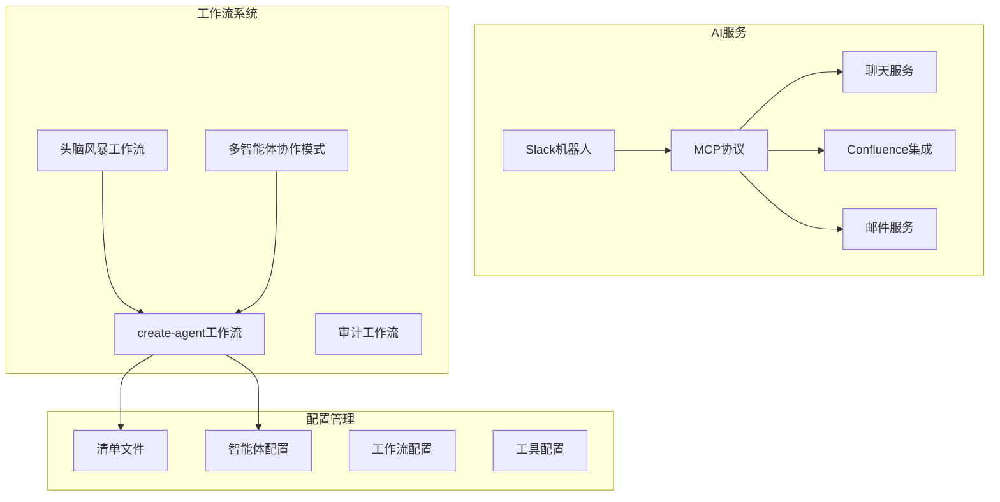
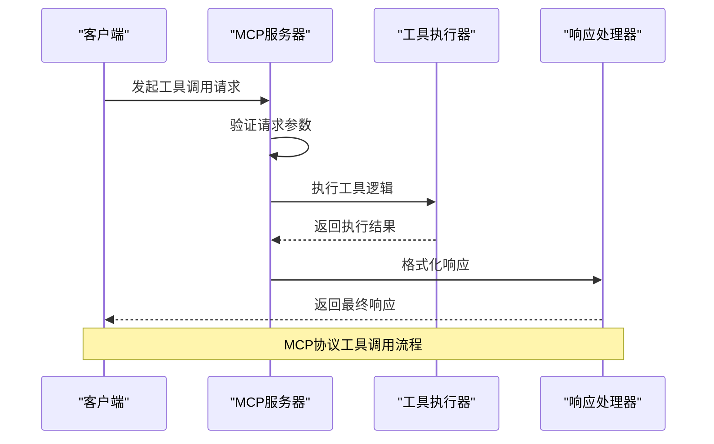
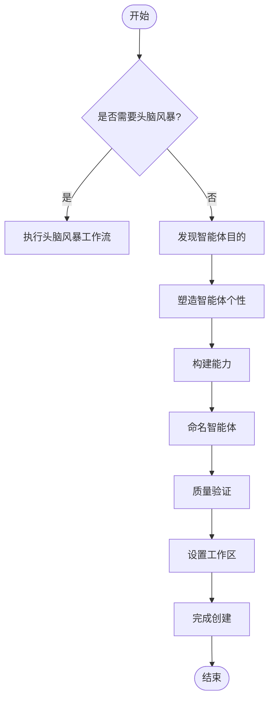
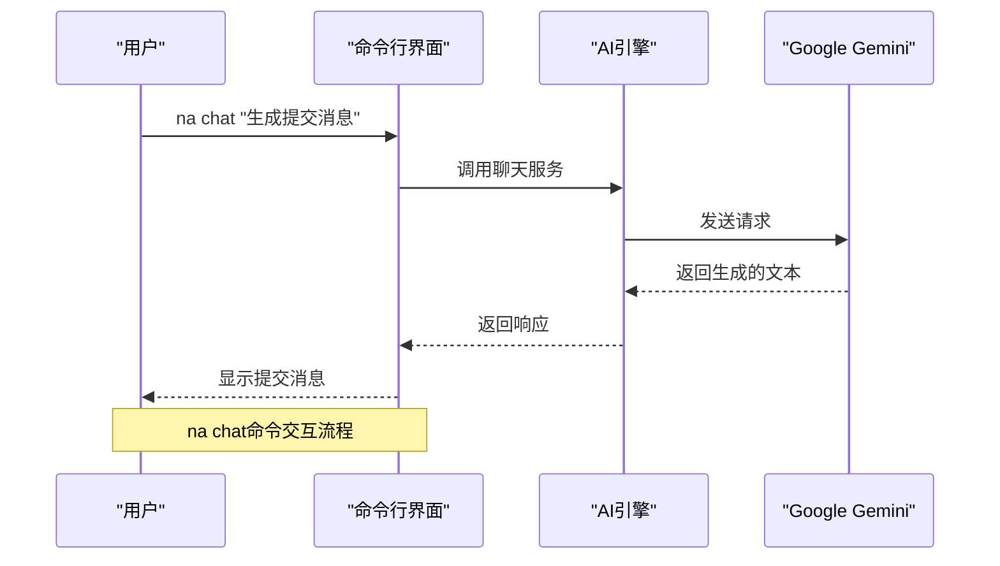
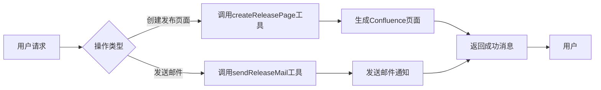

# AI驱动的自动化工作流

<cite>
**本文档引用的文件**  
- [mcp.ts](file://packages/ai/src/index.ts)
- [chat/index.ts](file://packages/ai/src/services/chat/index.ts)
- [confluence/mcp.ts](file://packages/ai/src/services/confluence/mcp.ts)
- [mails/mcp.ts](file://packages/ai/src/services/mails/mcp.ts)
- [slack/bot.ts](file://packages/ai/src/services/slack/bot.ts)
- [create-agent/workflow.yaml](file://_bmad/bmb/workflows/create-agent/workflow.yaml)
- [create-agent/instructions.md](file://_bmad/bmb/workflows/create-agent/instructions.md)
- [create-agent/steps/step-01-brainstorm.md](file://_bmad/bmb/workflows/create-agent/steps/step-01-brainstorm.md)
- [create-agent/steps/step-07-validate.md](file://_bmad/bmb/workflows/create-agent/steps/step-07-validate.md)
- [workflow-manifest.csv](file://_bmad/_config/workflow-manifest.csv)
</cite>

## 目录
1. [简介](#简介)
2. [项目结构](#项目结构)
3. [MCP协议实现机制](#mcp协议实现机制)
4. [create-agent工作流剖析](#create-agent工作流剖析)
5. [AI交互示例](#ai交互示例)
6. [配置与安全](#配置与安全)
7. [性能监控与调试](#性能监控与调试)
8. [结论](#结论)

## 简介
本文档全面介绍AI驱动的自动化工作流系统，重点解析Model Context Protocol（MCP）协议在mcp.ts中的实现机制，深入剖析create-agent工作流的YAML定义，并提供实际交互示例。系统通过多智能体协作和自动化工作流，实现了从头脑风暴到验证的完整Agent创建流程。

## 项目结构
系统采用模块化架构，主要包含AI服务、工作流定义和配置管理三个核心部分。AI服务通过MCP协议与外部系统集成，工作流定义采用YAML和Markdown混合格式，配置管理通过CSV和YAML文件实现。

**图表来源**
- [mcp.ts](file://packages/ai/src/index.ts)
- [create-agent/workflow.yaml](file://_bmad/bmb/workflows/create-agent/workflow.yaml)
- [workflow-manifest.csv](file://_bmad/_config/workflow-manifest.csv)

**本节来源**
- [mcp.ts](file://packages/ai/src/index.ts)
- [create-agent/workflow.yaml](file://_bmad/bmb/workflows/create-agent/workflow.yaml)

## MCP协议实现机制
MCP（Model Context Protocol）协议是系统的核心通信机制，负责管理上下文、工具调用和响应处理。协议通过FastMCP库实现，采用标准化的工具注册和执行模式。

### 上下文管理
系统通过环境变量和配置文件管理上下文信息，包括API密钥、用户偏好和项目设置。上下文在运行时动态加载，确保每个操作都基于最新的环境状态。

### 工具调用
MCP协议定义了标准化的工具调用接口，每个工具包含名称、描述、参数定义和执行函数。工具通过addTool方法注册到服务器，支持异步执行和错误处理。

**图表来源**
- [mcp.ts](file://packages/ai/src/index.ts)
- [confluence/mcp.ts](file://packages/ai/src/services/confluence/mcp.ts)
- [mails/mcp.ts](file://packages/ai/src/services/mails/mcp.ts)

**本节来源**
- [mcp.ts](file://packages/ai/src/index.ts)
- [confluence/mcp.ts](file://packages/ai/src/services/confluence/mcp.ts)
- [mails/mcp.ts](file://packages/ai/src/services/mails/mcp.ts)

## create-agent工作流剖析
create-agent工作流是一个多步骤的智能体创建流程，从头脑风暴到最终验证，完整实现了智能Agent的构建过程。

### 工作流定义
工作流通过YAML文件定义核心配置，包括名称、描述、作者和关键变量。配置源指向项目根目录的配置文件，确保工作流能够访问全局设置。

**图表来源**
- [create-agent/workflow.yaml](file://_bmad/bmb/workflows/create-agent/workflow.yaml)
- [create-agent/instructions.md](file://_bmad/bmb/workflows/create-agent/instructions.md)

### 多步骤流程
工作流包含13个步骤，每个步骤都有明确的目标和执行规则：

1. **头脑风暴**：可选的创意探索阶段
2. **技术文档加载**：加载智能体构建文档
3. **目的发现**：通过自然对话发现智能体的核心目的
4. **个性塑造**：确定智能体的角色、身份、沟通风格和原则
5. **能力构建**：定义智能体应具备的能力
6. **命令细化**：将自然语言能力转化为技术YAML命令结构
7. **命名智能体**：基于已发现的特性为智能体命名
8. **整合**：生成完整的YAML配置
9. **个性化**：创建自定义配置文件
10. **工作区设置**：为专家型智能体设置个人工作区
11. **构建工具处理**：处理构建工具的可用性
12. **质量检查**：运行验证对话
13. **庆祝与下一步**：庆祝完成并指导后续步骤

**本节来源**
- [create-agent/workflow.yaml](file://_bmad/bmb/workflows/create-agent/workflow.yaml)
- [create-agent/instructions.md](file://_bmad/bmb/workflows/create-agent/instructions.md)
- [create-agent/steps/step-01-brainstorm.md](file://_bmad/bmb/workflows/create-agent/steps/step-01-brainstorm.md)

## AI交互示例
系统支持多种AI交互方式，包括命令行、Slack消息和Confluence集成。

### na chat命令
通过na chat命令可以与AI进行交互，生成代码、文档或执行复合操作：

**图表来源**
- [chat/index.ts](file://packages/ai/src/services/chat/index.ts)
- [mcp.ts](file://packages/ai/src/index.ts)

### 复合操作执行
系统支持执行复杂的复合操作，如创建发布页面并发送邮件通知：

**图表来源**
- [confluence/mcp.ts](file://packages/ai/src/services/confluence/mcp.ts)
- [mails/mcp.ts](file://packages/ai/src/services/mails/mcp.ts)

**本节来源**
- [chat/index.ts](file://packages/ai/src/services/chat/index.ts)
- [confluence/mcp.ts](file://packages/ai/src/services/confluence/mcp.ts)
- [mails/mcp.ts](file://packages/ai/src/services/mails/mcp.ts)

## 配置与安全
系统提供灵活的配置选项和严格的安全考虑，确保工作流的可靠性和安全性。

### 配置选项
系统通过多种配置文件管理设置：

- **YAML配置**：用于定义工作流和智能体
- **CSV清单**：用于管理代理、任务和工具
- **环境变量**：用于存储敏感信息

### 安全考虑
系统实施了多层次的安全措施：

- **API密钥保护**：敏感信息通过环境变量管理
- **输入验证**：所有用户输入都经过严格验证
- **权限控制**：不同操作有不同的权限要求

### 错误恢复机制
系统具备完善的错误恢复机制：

- **异常捕获**：所有关键操作都包含异常处理
- **重试机制**：失败的操作可以自动重试
- **日志记录**：详细记录所有操作和错误

**本节来源**
- [mcp.ts](file://packages/ai/src/index.ts)
- [create-agent/workflow.yaml](file://_bmad/bmb/workflows/create-agent/workflow.yaml)
- [create-agent/instructions.md](file://_bmad/bmb/workflows/create-agent/instructions.md)

## 性能监控与调试
系统提供全面的性能监控和调试指南，帮助开发者优化工作流。

### 性能监控
- **响应时间跟踪**：记录每个操作的执行时间
- **资源使用监控**：监控内存和CPU使用情况
- **调用频率统计**：分析工具使用模式

### 调试指南
- **日志级别控制**：支持不同级别的日志输出
- **错误追踪**：详细的错误堆栈信息
- **调试工具**：内置的调试命令和工具

**本节来源**
- [mcp.ts](file://packages/ai/src/index.ts)
- [slack/bot.ts](file://packages/ai/src/services/slack/bot.ts)
- [chat/index.ts](file://packages/ai/src/services/chat/index.ts)

## 结论
本文档详细介绍了AI驱动的自动化工作流系统，涵盖了MCP协议实现、create-agent工作流、AI交互示例、配置安全和性能监控等方面。系统通过标准化的协议和灵活的工作流定义，实现了高效、可靠的智能体创建和管理。