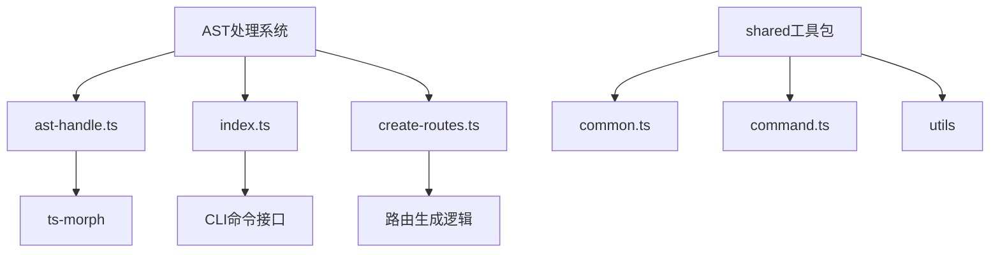
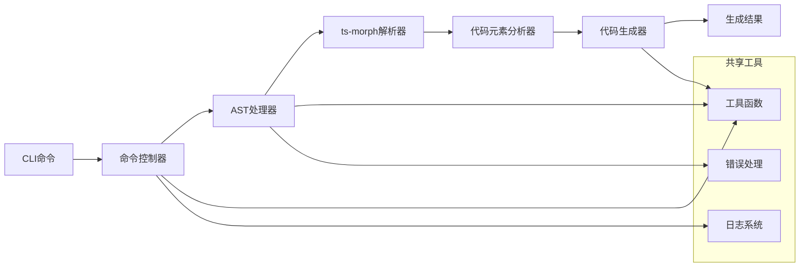
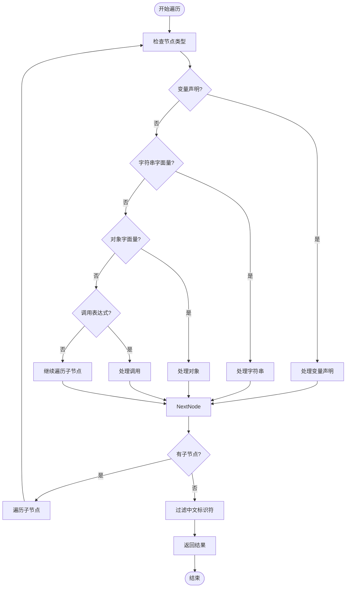
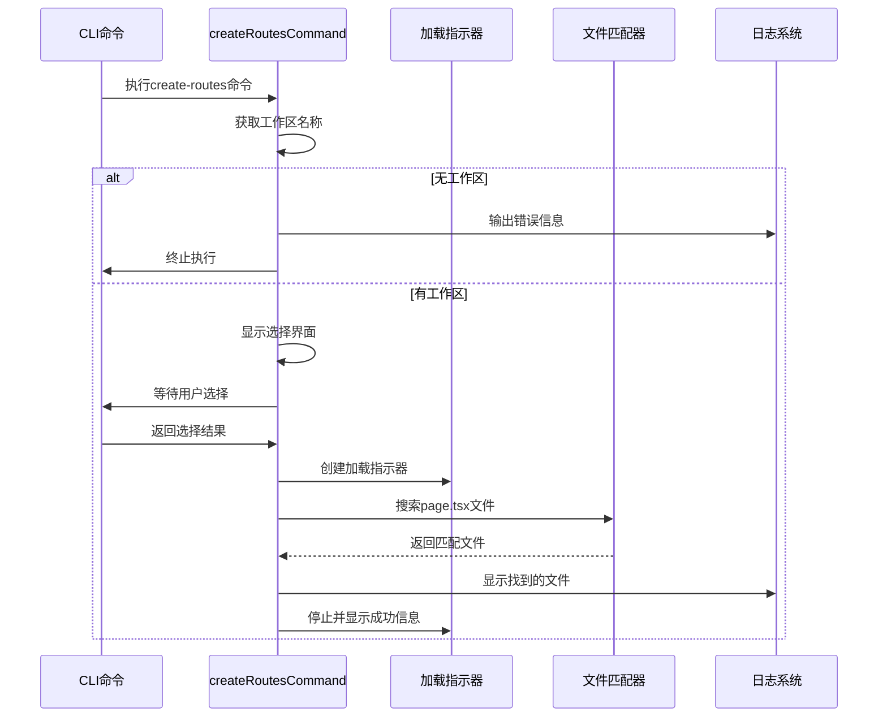

# AST处理与代码生成

<cite>
**本文档引用的文件**
- [ast-handle.ts](file://packages/file/src/commands/ast/ast-handle.ts)
- [create-routes.ts](file://packages/file/src/commands/create-routes.ts)
- [index.ts](file://packages/file/src/commands/ast/index.ts)
- [common.ts](file://packages/shared/src/utils/common.ts)
- [command.ts](file://packages/shared/src/utils/command.ts)
</cite>

## 目录
1. [简介](#简介)
2. [项目结构](#项目结构)
3. [核心组件](#核心组件)
4. [架构概述](#架构概述)
5. [详细组件分析](#详细组件分析)
6. [依赖分析](#依赖分析)
7. [性能考虑](#性能考虑)
8. [故障排除指南](#故障排除指南)
9. [结论](#结论)

## 简介
本文档详细阐述了nemo-cli工具中AST处理与代码生成功能的实现机制。重点分析`ast-handle.ts`如何解析TypeScript文件的抽象语法树并提取代码元素，以及`create-routes.ts`如何基于AST分析结果自动生成路由配置。文档还探讨了AST遍历算法、性能优化、错误处理机制及扩展性设计。

## 项目结构
nemo-cli的AST处理功能主要位于`packages/file/src/commands/ast/`目录下，形成了一个模块化的代码分析与生成系统。



**图示来源**
- [ast-handle.ts](file://packages/file/src/commands/ast/ast-handle.ts)
- [create-routes.ts](file://packages/file/src/commands/create-routes.ts)
- [index.ts](file://packages/file/src/commands/ast/index.ts)

**本节来源**
- [packages/file/src/commands/ast/](file://packages/file/src/commands/ast/)

## 核心组件
系统的核心组件包括AST处理器`ast-handle.ts`和路由生成器`create-routes.ts`，它们共同实现了从代码分析到自动化生成的工作流。

**本节来源**
- [ast-handle.ts](file://packages/file/src/commands/ast/ast-handle.ts)
- [create-routes.ts](file://packages/file/src/commands/create-routes.ts)

## 架构概述
系统采用分层架构设计，从CLI命令接口到AST解析引擎再到代码生成器，形成了清晰的处理流水线。



**图示来源**
- [ast-handle.ts](file://packages/file/src/commands/ast/ast-handle.ts)
- [create-routes.ts](file://packages/file/src/commands/create-routes.ts)
- [index.ts](file://packages/file/src/commands/ast/index.ts)

## 详细组件分析

### AST处理器分析
`ast-handle.ts`是系统的核心AST处理模块，负责解析TypeScript文件并提取代码元素。

#### AST遍历算法
系统实现了递归式的AST遍历算法，能够深度遍历语法树节点并提取特定类型的代码元素。



**图示来源**
- [ast-handle.ts](file://packages/file/src/commands/ast/ast-handle.ts#L98-L125)

#### 节点处理机制
系统实现了多种节点处理器，针对不同类型的AST节点进行专门处理。

```mermaid
classDiagram
class ASTHandler {
+project : Project
+astHandler(path : string, options : ASTHandlerOptions) : Promise~IdentifiersType[]~
}
class NodeProcessor {
+variableHandle(node : VariableDeclaration) : string[]
+handleObjectLiteralExpression(node : ObjectLiteralExpression) : string[]
+handleCallExpression(node : CallExpression) : string[]
+extractChineseIdentifiers(node : Node) : string[]
}
class Options {
+excludeDirs? : string[]
+excludePatterns? : string[]
+includePatterns? : string[]
+extensions? : string[]
}
ASTHandler --> NodeProcessor : "包含"
ASTHandler --> Options : "使用"
NodeProcessor --> "ts-morph" : "依赖"
```

**图示来源**
- [ast-handle.ts](file://packages/file/src/commands/ast/ast-handle.ts)

**本节来源**
- [ast-handle.ts](file://packages/file/src/commands/ast/ast-handle.ts)

### 路由生成器分析
`create-routes.ts`模块负责基于AST分析结果生成路由配置。

#### 路由生成流程
系统通过文件系统扫描和模式匹配来识别页面组件并生成相应的路由配置。



**图示来源**
- [create-routes.ts](file://packages/file/src/commands/create-routes.ts)

**本节来源**
- [create-routes.ts](file://packages/file/src/commands/create-routes.ts)

## 依赖分析
系统依赖于多个内部和外部模块，形成了复杂的依赖关系网络。

```mermaid
graph TD
A[ast-handle.ts] --> B[ts-morph]
A --> C[@nemo-cli/shared]
D[create-routes.ts] --> C
D --> E[glob]
D --> F[colors]
G[index.ts] --> A
G --> H[getDiffFiles]
G --> I[createCheckbox]
C --> J[common.ts]
C --> K[command.ts]
C --> L[log.ts]
subgraph "外部依赖"
B
E
F
end
subgraph "内部共享"
J
K
L
end
```

**图示来源**
- [ast-handle.ts](file://packages/file/src/commands/ast/ast-handle.ts)
- [create-routes.ts](file://packages/file/src/commands/create-routes.ts)
- [index.ts](file://packages/file/src/commands/ast/index.ts)
- [common.ts](file://packages/shared/src/utils/common.ts)
- [command.ts](file://packages/shared/src/utils/command.ts)

**本节来源**
- [ast-handle.ts](file://packages/file/src/commands/ast/ast-handle.ts)
- [create-routes.ts](file://packages/file/src/commands/create-routes.ts)
- [common.ts](file://packages/shared/src/utils/common.ts)
- [command.ts](file://packages/shared/src/utils/command.ts)

## 性能考虑
系统在设计时考虑了多项性能优化策略，以确保大规模代码库处理的效率。

1. **增量处理**: 支持增量分析模式，只处理变更的文件
2. **目录排除**: 默认排除`node_modules`、`dist`等大型目录
3. **异步处理**: 采用异步I/O操作，避免阻塞主线程
4. **缓存机制**: 共享工具包中实现了函数缓存机制
5. **批量操作**: 支持批量文件处理，减少重复初始化开销

这些优化措施确保了系统在处理大型项目时仍能保持良好的响应性能。

## 故障排除指南
当AST处理或代码生成出现问题时，可参考以下常见问题及解决方案：

**本节来源**
- [ast-handle.ts](file://packages/file/src/commands/ast/ast-handle.ts#L175-L177)
- [create-routes.ts](file://packages/file/src/commands/create-routes.ts#L12-L15)

## 结论
nemo-cli的AST处理与代码生成功能提供了一套完整的自动化开发工具链。通过`ast-handle.ts`的深度AST分析和`create-routes.ts`的智能路由生成，系统能够显著提升开发效率。系统的模块化设计和扩展性架构为未来功能增强提供了坚实基础，而完善的错误处理和性能优化确保了生产环境的稳定性。