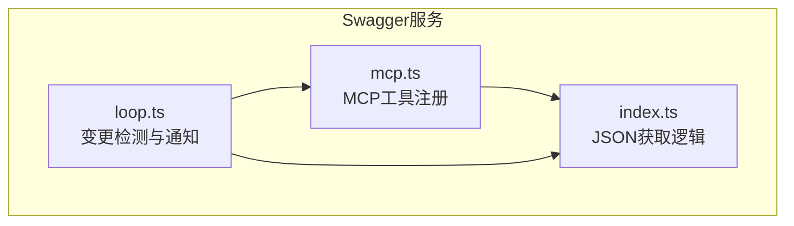
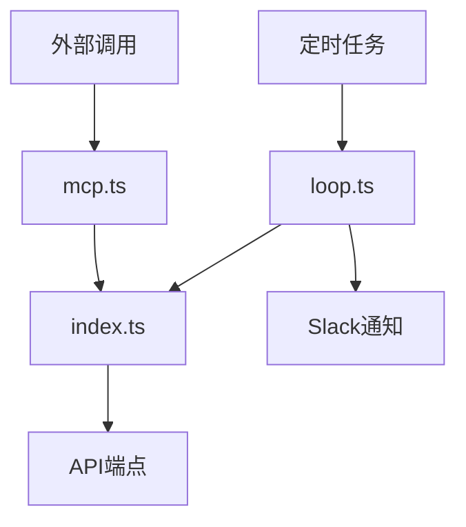
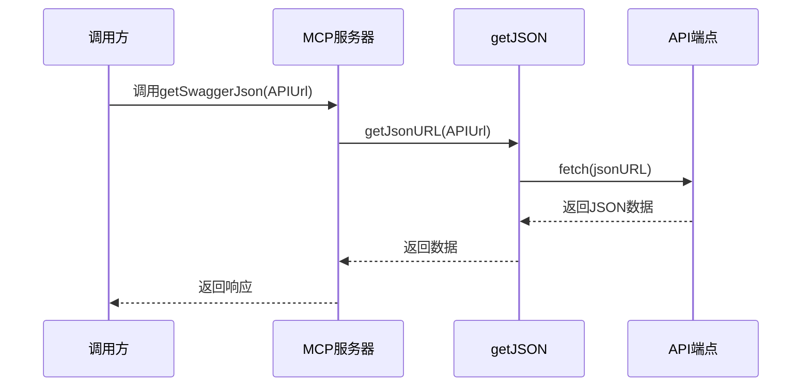
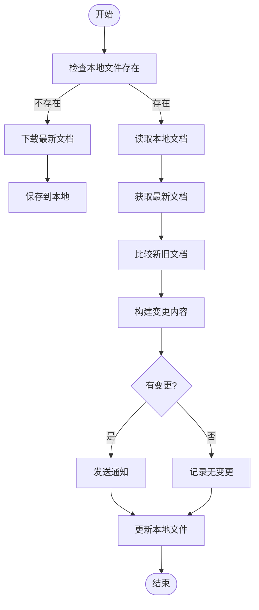
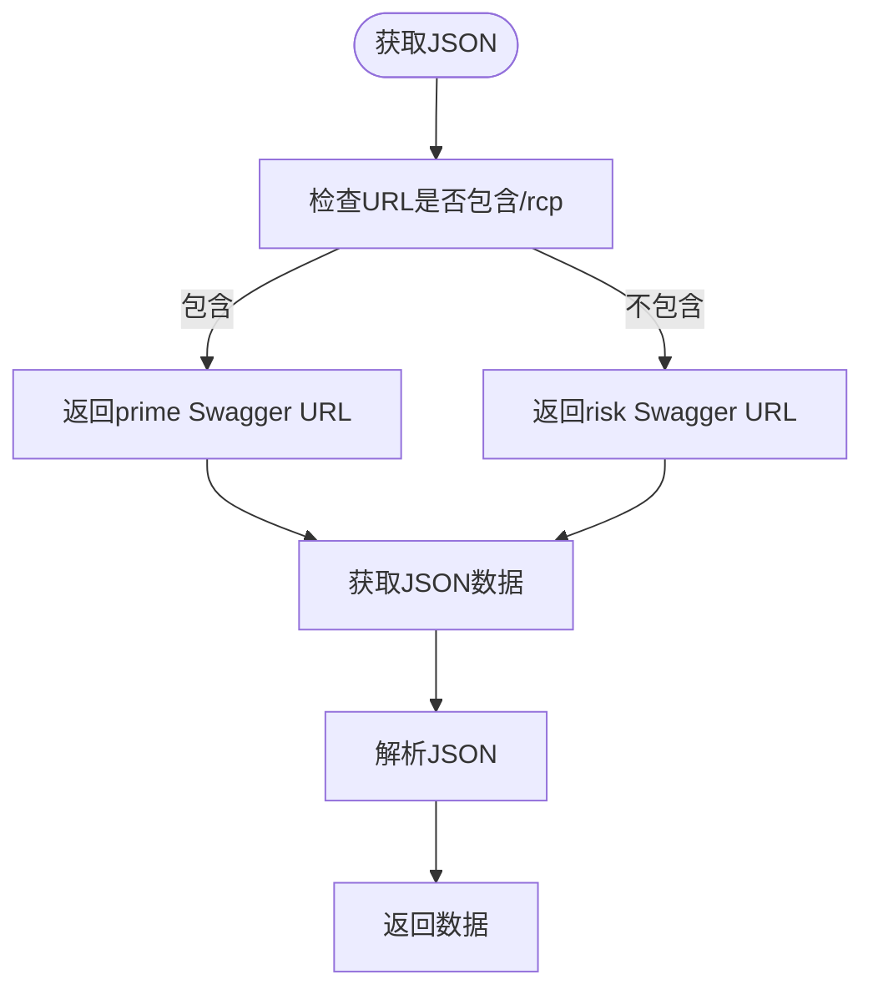
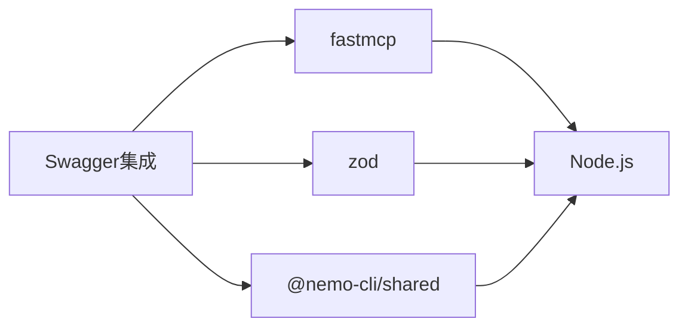

# OpenAPI/Swagger API集成

<cite>
**本文档中引用的文件**  
- [mcp.ts](file://packages/ai/src/services/swagger/mcp.ts)
- [index.ts](file://packages/ai/src/services/swagger/index.ts)
- [loop.ts](file://packages/ai/src/services/swagger/loop.ts)
- [package.json](file://packages/ai/package.json)
</cite>

## 目录
1. [简介](#简介)
2. [项目结构](#项目结构)
3. [核心组件](#核心组件)
4. [架构概述](#架构概述)
5. [详细组件分析](#详细组件分析)
6. [依赖分析](#依赖分析)
7. [性能考虑](#性能考虑)
8. [故障排除指南](#故障排除指南)
9. [结论](#结论)

## 简介
本文档详细介绍了nemo-cli项目中OpenAPI/Swagger API集成的实现。该系统通过解析OpenAPI规范文件，提取端点、请求/响应模式和认证要求，实现了对API变更的监控和通知。核心功能包括动态请求构建、错误处理和响应解析，支持通过自然语言指令调用外部API。

## 项目结构
项目中的OpenAPI/Swagger集成主要位于`packages/ai/src/services/swagger/`目录下，包含三个主要文件：`mcp.ts`、`index.ts`和`loop.ts`。这些文件共同实现了API规范的获取、解析和变更检测功能。

**图示来源**
- [mcp.ts](file://packages/ai/src/services/swagger/mcp.ts)
- [index.ts](file://packages/ai/src/services/swagger/index.ts)
- [loop.ts](file://packages/ai/src/services/swagger/loop.ts)

**本节来源**
- [packages/ai/src/services/swagger/](file://packages/ai/src/services/swagger/)

## 核心组件
系统的核心组件包括Swagger JSON获取服务、API变更检测引擎和Slack通知系统。`index.ts`文件提供了获取Swagger JSON的统一接口，`loop.ts`实现了定期检查API变更的循环机制，而`mcp.ts`则将这些功能暴露为MCP工具供外部调用。

**本节来源**
- [index.ts](file://packages/ai/src/services/swagger/index.ts#L1-L21)
- [loop.ts](file://packages/ai/src/services/swagger/loop.ts#L1-L276)
- [mcp.ts](file://packages/ai/src/services/swagger/mcp.ts#L1-L20)

## 架构概述
系统采用模块化架构，各组件职责分明。`index.ts`负责提供基础的JSON获取功能，`loop.ts`实现定时任务和变更检测，`mcp.ts`则作为外部接口层。这种设计使得系统既可独立运行进行API监控，也可作为工具集成到更大的工作流中。

**图示来源**
- [mcp.ts](file://packages/ai/src/services/swagger/mcp.ts)
- [index.ts](file://packages/ai/src/services/swagger/index.ts)
- [loop.ts](file://packages/ai/src/services/swagger/loop.ts)

## 详细组件分析

### MCP工具实现分析
`mcp.ts`文件实现了FastMCP工具的注册，提供了一个名为`getSwaggerJson`的工具，允许外部系统通过指定API URL来获取Swagger JSON。

**图示来源**
- [mcp.ts](file://packages/ai/src/services/swagger/mcp.ts#L6-L19)
- [index.ts](file://packages/ai/src/services/swagger/index.ts#L14-L20)

### API变更检测机制分析
`loop.ts`文件实现了完整的API变更检测流程，包括从远程获取最新Swagger文档、与本地缓存比较、生成变更报告并发送通知。

**图示来源**
- [loop.ts](file://packages/ai/src/services/swagger/loop.ts#L187-L246)

### JSON获取逻辑分析
`index.ts`文件实现了根据URL选择相应Swagger JSON端点的逻辑，为系统提供了灵活的API文档获取能力。

**图示来源**
- [index.ts](file://packages/ai/src/services/swagger/index.ts#L7-L12)

**本节来源**
- [mcp.ts](file://packages/ai/src/services/swagger/mcp.ts#L1-L20)
- [index.ts](file://packages/ai/src/services/swagger/index.ts#L1-L21)
- [loop.ts](file://packages/ai/src/services/swagger/loop.ts#L1-L276)

## 依赖分析
系统依赖于多个外部包和内部模块。主要外部依赖包括`fastmcp`用于MCP工具框架，`zod`用于参数验证。内部依赖则包括`@nemo-cli/shared`等共享模块。

**图示来源**
- [package.json](file://packages/ai/package.json#L41-L51)
- [mcp.ts](file://packages/ai/src/services/swagger/mcp.ts#L1-L2)

**本节来源**
- [package.json](file://packages/ai/package.json#L1-L54)

## 性能考虑
系统在设计时考虑了性能和可靠性。通过本地缓存Swagger文档，避免了每次检查都进行网络请求。同时，使用流式处理响应数据，减少了内存占用。错误处理机制确保了单个API检查失败不会影响整个系统运行。

## 故障排除指南
常见问题包括网络连接失败、Slack webhook配置错误和JSON解析错误。系统提供了详细的错误日志，帮助快速定位问题。确保`slackWebhookUrl`正确配置，并检查网络连接性是解决大多数问题的关键。

**本节来源**
- [loop.ts](file://packages/ai/src/services/swagger/loop.ts#L230-L237)
- [loop.ts](file://packages/ai/src/services/swagger/loop.ts#L196-L198)

## 结论
nemo-cli的OpenAPI/Swagger集成提供了一套完整的API变更监控解决方案。通过模块化设计和清晰的职责划分，系统既可独立运行，也可作为工具集成到更大的开发工作流中。该实现展示了如何有效地监控API变更并及时通知团队成员，有助于提高开发效率和系统稳定性。