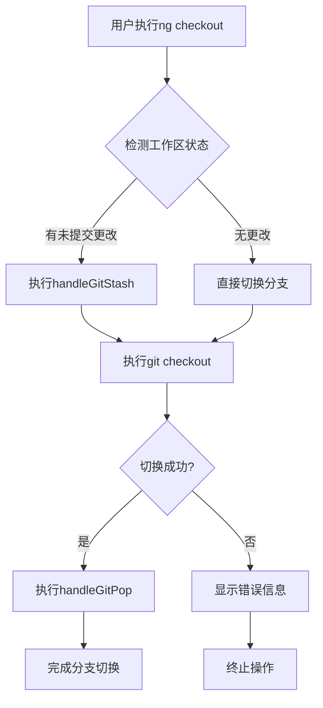
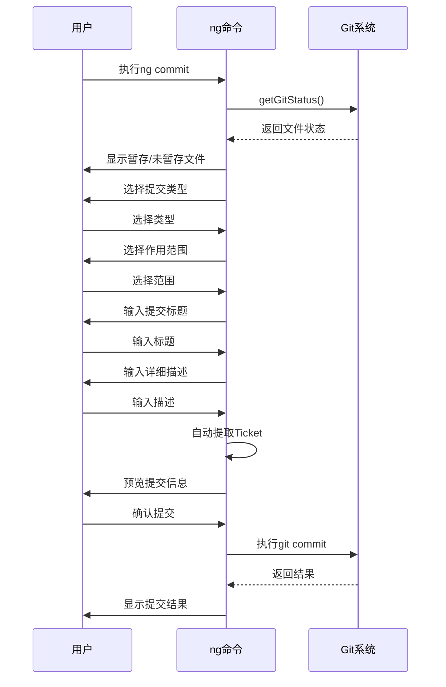

# 智能Git操作

<cite>
**本文档引用的文件**  
- [checkout.ts](file://packages/git/src/commands/checkout.ts)
- [commit.ts](file://packages/git/src/commands/commit.ts)
- [commit-options.ts](file://packages/git/src/commands/commit-options.ts)
- [stash.ts](file://packages/git/src/commands/stash.ts)
- [utils.ts](file://packages/git/src/utils.ts)
- [architecture.md](file://docs/packages-git/architecture.md)
- [command-reference.md](file://docs/packages-git/command-reference.md)
</cite>

## 目录
1. [简介](#简介)
2. [智能分支切换机制](#智能分支切换机制)
3. [提交辅助功能](#提交辅助功能)
4. [复杂提交场景处理](#复杂提交场景处理)
5. [与标准Git命令的兼容性](#与标准git命令的兼容性)
6. [配置智能操作行为](#配置智能操作行为)
7. [故障排查指南](#故障排查指南)
8. [性能优化建议](#性能优化建议)

## 简介

智能Git操作是nemo-cli工具集中的核心功能，旨在通过ng命令提供增强的Git工作流体验。该系统实现了智能分支切换时的自动暂存与恢复机制，以及符合规范的提交信息生成辅助功能。通过自动化处理常见的开发任务，如状态检测、变更保存与恢复、提交信息格式化等，显著提升了开发效率和代码管理质量。

**Section sources**
- [architecture.md](file://docs/packages-git/architecture.md#1-架构概览)
- [command-reference.md](file://docs/packages-git/command-reference.md#全局选项)

## 智能分支切换机制

智能分支切换功能通过ng checkout命令实现，其核心是在分支切换过程中自动处理未提交的更改。当用户执行分支切换操作时，系统会自动检测当前工作区的状态，并在必要时执行暂存（stash）和恢复（pop）操作。

该机制的工作流程如下：首先，系统调用handleGitStash函数创建一个以目标分支命名的暂存记录；然后执行标准的git checkout命令进行分支切换；最后，在切换成功后调用handleGitPop函数恢复之前暂存的更改。这种设计确保了开发人员可以在不同分支间无缝切换，而无需手动管理未完成的工作。

**Diagram sources**
- [checkout.ts](file://packages/git/src/commands/checkout.ts#L16-L49)
- [utils.ts](file://packages/git/src/utils.ts#L274-L309)

**Section sources**
- [checkout.ts](file://packages/git/src/commands/checkout.ts#L16-L49)
- [utils.ts](file://packages/git/src/utils.ts#L274-L309)

## 提交辅助功能

提交辅助功能通过ng commit命令实现，为开发人员提供了一套完整的交互式提交流程。该功能不仅能够自动提取变更文件，还能生成符合Conventional Commits规范的提交信息建议。

系统首先通过getGitStatus函数获取当前工作区的文件状态，区分已暂存和未暂存的文件。然后引导用户完成一系列步骤：选择提交类型（如feat、fix、docs等）、选择作用范围（如app、shared、server等）、输入提交标题和详细描述。特别地，系统能够从分支名称中自动提取Ticket编号，支持多种命名约定，如feature/PRIME-1500或PRIME-1500-feature等格式。

**Diagram sources**
- [commit.ts](file://packages/git/src/commands/commit.ts#L60-L158)
- [utils.ts](file://packages/git/src/utils.ts#L36-L78)

**Section sources**
- [commit.ts](file://packages/git/src/commands/commit.ts#L60-L158)
- [commit-options.ts](file://packages/git/src/commands/commit-options.ts#L1-L220)

## 复杂提交场景处理

对于复杂的提交场景，系统通过commit-options.ts文件中的配置选项提供了灵活的处理能力。这些选项允许开发团队根据项目需求定制提交行为，包括提交类型、作用范围、验证规则等。

配置文件定义了标准的提交类型选项，每个类型都包含相应的emoji标识和提示信息。例如，"feat"类型对应🌟emoji，表示新功能；"fix"类型对应🐛emoji，表示bug修复。同时，系统支持通过commitlint.config文件进行扩展配置，允许团队自定义提交规范。

在处理复杂场景时，系统还集成了lint-staged功能，在提交前自动运行代码检查和格式化工具。如果检查失败，会提示用户是否继续提交，从而确保代码质量的一致性。此外，系统支持在提交后立即推送变更，并提供交互式确认，避免意外推送。

**Section sources**
- [commit-options.ts](file://packages/git/src/commands/commit-options.ts#L1-L220)
- [commit.ts](file://packages/git/src/commands/commit.ts#L32-L58)

## 与标准Git命令的兼容性

智能Git操作设计时充分考虑了与标准Git命令的兼容性，确保用户可以在ng命令和原生git命令之间无缝切换。所有ng命令的底层都调用标准的Git命令，只是在执行前后添加了智能化的处理逻辑。

例如，ng pull命令在执行git pull之前会自动暂存本地更改，在拉取完成后自动恢复这些更改。这与直接使用git pull --rebase的行为相似，但提供了更好的用户体验和错误处理。同样，ng push命令在推送前会确认目标分支，防止意外覆盖远程分支。

系统还保留了所有标准Git命令的输出格式和退出码，使得现有的CI/CD管道和自动化脚本可以无需修改即可与ng命令协同工作。这种设计既提供了智能化的便利，又保持了与现有工作流的兼容性。

**Section sources**
- [pull.ts](file://packages/git/src/commands/pull.ts#L4-L48)
- [push.ts](file://packages/git/src/commands/push.ts#L6-L23)

## 配置智能操作行为

智能操作的行为可以通过配置文件进行定制，以适应不同团队和项目的需求。主要的配置选项集中在commit-options.ts文件中，包括提交类型、作用范围、验证规则等。

用户可以通过创建commitlint.config.js文件来扩展或修改默认的提交规范。配置文件支持继承标准的@commitlint/config-conventional配置，并可以添加自定义的规则。例如，可以限制提交标题的最大长度，或者定义项目特定的作用范围。

对于分支管理行为，系统提供了多种选项来控制自动暂存的触发条件。默认情况下，只要存在未提交的更改，就会触发自动暂存。但可以通过环境变量或配置文件调整这一行为，例如设置只在特定类型的分支切换时启用自动暂存。

**Section sources**
- [commit-options.ts](file://packages/git/src/commands/commit-options.ts#L99-L177)
- [utils.ts](file://packages/git/src/utils.ts#L274-L309)

## 故障排查指南

在使用智能Git操作时，可能会遇到一些常见问题，如状态冲突、暂存恢复失败等。本节提供相应的解决方案。

当出现状态冲突时，首先检查是否有未完成的合并或变基操作。可以使用git status命令查看当前状态，并根据提示完成相应的操作。如果问题仍然存在，可以尝试手动执行git stash和git stash pop来管理暂存。

对于暂存恢复失败的情况，通常是由于文件冲突导致的。系统会在恢复失败时显示详细的错误信息，建议先解决冲突再继续操作。可以使用git diff命令查看具体的冲突位置，并手动编辑文件解决冲突。

如果遇到配置不生效的问题，检查配置文件的路径和格式是否正确。commitlint配置文件应位于项目根目录，并且文件名必须是commitlint.config.js或相应的扩展名。同时确保文件导出的配置对象格式正确。

**Section sources**
- [stash.ts](file://packages/git/src/commands/stash.ts#L42-L109)
- [utils.ts](file://packages/git/src/utils.ts#L294-L309)

## 性能优化建议

为了确保智能Git操作的高效运行，建议采取以下性能优化措施：

首先，合理使用缓存机制。系统在单次命令执行过程中会缓存分支列表等信息，避免重复查询。建议在脚本中批量处理相关操作，以充分利用这一特性。

其次，对于大型仓库，可以考虑限制自动暂存的范围。通过配置只暂存特定目录或类型的文件，减少暂存操作的开销。同时，建议定期清理不再需要的暂存记录，保持仓库的整洁。

最后，在CI/CD环境中，可以禁用某些交互式功能，如提交信息预览和确认，以加快自动化流程的执行速度。这可以通过设置相应的环境变量或配置选项来实现。

**Section sources**
- [architecture.md](file://docs/packages-git/architecture.md#7-性能考虑)
- [utils.ts](file://packages/git/src/utils.ts#L318-L340)