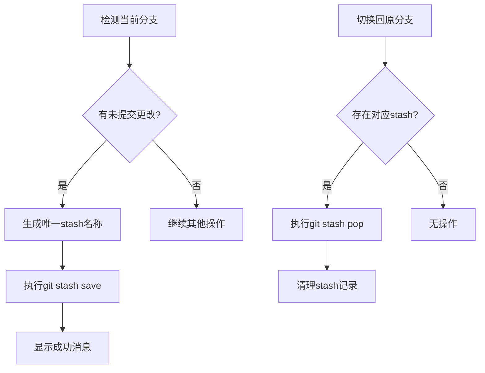
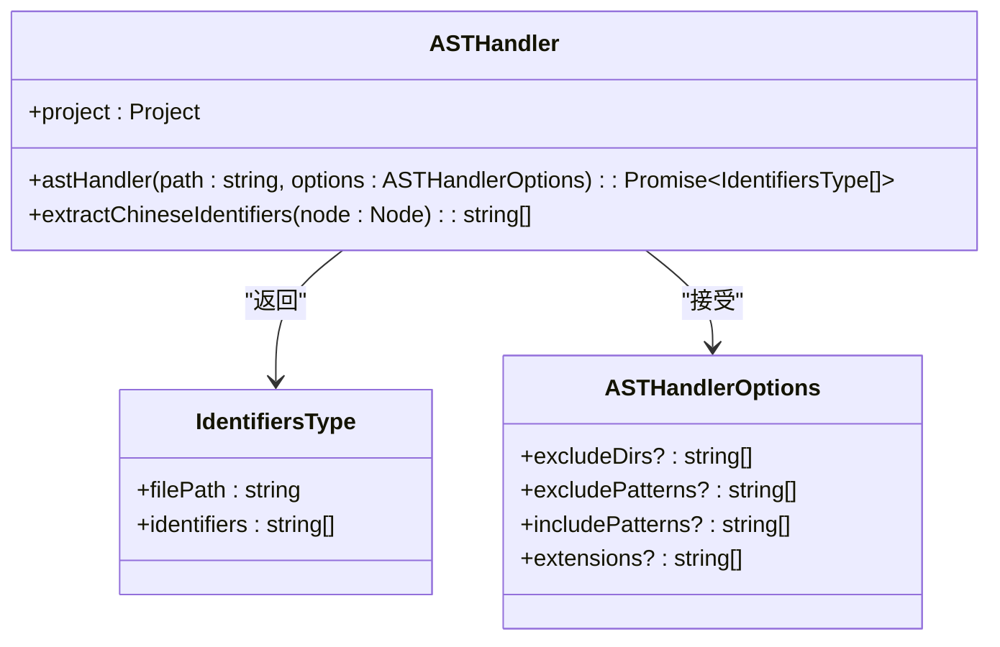
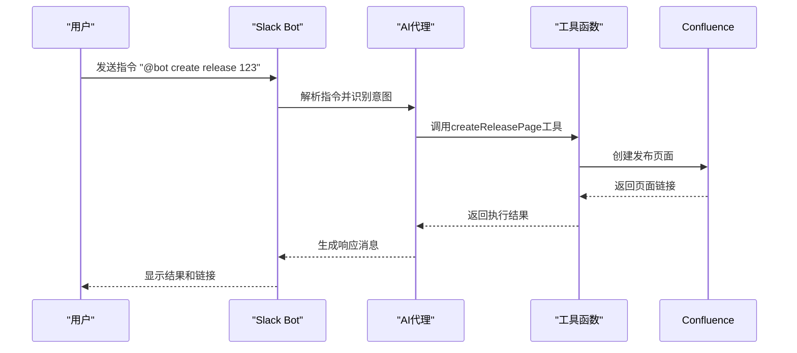
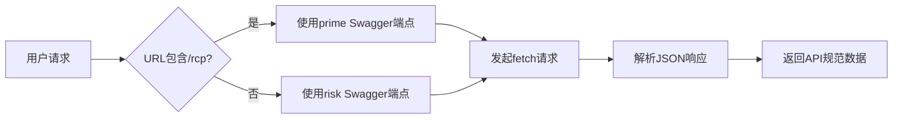

# 高级功能

<cite>
**本文档中引用的文件**  
- [stash.ts](file://packages/git/src/commands/stash.ts)
- [utils.ts](file://packages/git/src/utils.ts)
- [ast-handle.ts](file://packages/file/src/commands/ast/ast-handle.ts)
- [index.ts](file://packages/file/src/index.ts)
- [ast/index.ts](file://packages/file/src/commands/ast/index.ts)
- [swagger/index.ts](file://packages/ai/src/services/swagger/index.ts)
- [mcp.ts](file://packages/ai/src/services/confluence/mcp.ts)
- [mcp.ts](file://packages/ai/src/services/mails/mcp.ts)
- [create-routes.ts](file://packages/file/src/commands/create-routes.ts)
</cite>

## 目录
1. [简介](#简介)
2. [Git工作流智能功能](#git工作流智能功能)
3. [文件操作中的AST解析与代码生成](#文件操作中的ast解析与代码生成)
4. [AI驱动的自动化工作流](#ai驱动的自动化工作流)
5. [OpenAPI/Swagger外部API集成](#openapiswagger外部api集成)
6. [高级使用场景示例](#高级使用场景示例)
7. [配置选项与最佳实践](#配置选项与最佳实践)
8. [结论](#结论)

## 简介
本文档详细介绍了Nemo-CLI工具中的高级功能，涵盖Git工作流的智能管理、文件操作中的AST解析能力、AI驱动的自动化工作流以及外部API集成等复杂特性。这些功能旨在提升开发效率，实现智能化的开发流程自动化。

## Git工作流智能功能

Nemo-CLI提供了智能的Git stash管理功能，能够自动处理分支切换时的变更暂存与恢复。当用户在不同分支间切换时，系统会自动检测未提交的更改并进行智能stash操作。

该功能通过`handleGitStash`和`handleGitPop`函数实现，能够在分支切换前自动保存当前工作区的更改，并在返回原分支时自动恢复。系统使用时间戳生成唯一的stash名称，确保不同分支的暂存内容不会冲突。



**图源**
- [stash.ts](file://packages/git/src/commands/stash.ts#L274-L285)
- [utils.ts](file://packages/git/src/utils.ts#L274-L310)

**节源**
- [stash.ts](file://packages/git/src/commands/stash.ts#L110-L157)
- [utils.ts](file://packages/git/src/utils.ts#L274-L310)

## 文件操作中的AST解析与代码生成

Nemo-CLI集成了强大的AST（抽象语法树）解析功能，能够深入分析TypeScript/TSX文件结构，提取代码中的关键信息并支持代码生成。

### AST解析实现原理

系统使用`ts-morph`库构建项目级AST分析器，通过递归遍历AST节点来提取中文文本字面量。`astHandler`函数接受文件路径和配置选项，支持排除特定目录（如node_modules、dist等），并可自定义文件扩展名过滤。



**图源**
- [ast-handle.ts](file://packages/file/src/commands/ast/ast-handle.ts#L21-L182)
- [index.ts](file://packages/file/src/commands/ast/index.ts#L5-L70)

**节源**
- [ast-handle.ts](file://packages/file/src/commands/ast/ast-handle.ts#L1-L182)
- [index.ts](file://packages/file/src/commands/ast/index.ts#L1-L70)

### 代码生成能力

系统提供了`create-routes`命令，能够自动扫描指定包中的`page.tsx`文件并生成路由配置。该功能通过`glob`模式匹配文件系统，识别Next.js应用的页面结构，并为每个页面创建相应的路由条目。

## AI驱动的自动化工作流

Nemo-CLI集成了AI驱动的自动化工作流，能够根据产品需求文档（PRD）自动生成代码结构和相关配置。

### 工作流架构

系统基于`FastMCP`框架构建AI代理，通过Slack集成接收用户指令，并调用相应的工具函数执行任务。AI工作流支持自然语言交互，用户可以通过简单的命令触发复杂的自动化流程。



**图源**
- [mcp.ts](file://packages/ai/src/services/confluence/mcp.ts#L8-L40)
- [bot.ts](file://packages/ai/src/services/slack/bot.ts#L6-L112)

**节源**
- [mcp.ts](file://packages/ai/src/services/confluence/mcp.ts#L1-L40)
- [bot.ts](file://packages/ai/src/services/slack/bot.ts#L1-L112)

## OpenAPI/Swagger外部API集成

Nemo-CLI提供了与外部API系统的集成能力，通过OpenAPI/Swagger规范实现服务发现和数据获取。

### 集成实现

系统通过`getJSON`函数从预定义的Swagger端点获取API规范，支持根据URL模式自动选择正确的API网关。目前集成了风险管理系统和核心交易平台的Swagger文档，为AI代理提供实时的API元数据。



**图源**
- [swagger/index.ts](file://packages/ai/src/services/swagger/index.ts#L1-L21)

**节源**
- [swagger/index.ts](file://packages/ai/src/services/swagger/index.ts#L1-L21)

## 高级使用场景示例

### 智能开发流程：AI与文件操作结合

以下示例展示如何结合AI驱动的工作流和文件操作功能实现智能开发流程：

1. 用户在Slack中发送指令："@nemo create module payment-service"
2. AI代理解析指令并调用`create-module`工作流
3. 系统自动生成模块目录结构和基础配置文件
4. 使用AST分析器扫描现有代码库，提取相关模式
5. 基于分析结果生成符合项目规范的初始代码
6. 自动创建Git分支并暂存初始提交
7. 通知用户模块创建完成并提供下一步指导

### 自动化发布流程

```mermaid
flowchart TD
A[用户指令: "发布版本1.2.0"] --> B[AI代理解析]
B --> C[调用createReleasePage]
C --> D[在Confluence创建发布文档]
D --> E[调用sendReleaseMail]
E --> F[发送发布通知邮件]
F --> G[更新项目状态]
G --> H[完成发布流程]
```

**节源**
- [mcp.ts](file://packages/ai/src/services/mails/mcp.ts#L7-L27)
- [mcp.ts](file://packages/ai/src/services/confluence/mcp.ts#L8-L40)

## 配置选项与最佳实践

### Git工作流配置

- **自动stash策略**：建议在团队协作环境中启用自动stash功能，避免未提交更改导致的冲突
- **分支命名规范**：遵循一致的分支命名约定，便于系统自动识别和管理stash
- **定期清理**：使用`ng stash drop`命令定期清理过期的stash记录

### AST分析配置

- **排除目录**：通过`--exclude`参数指定不需要分析的目录，如测试文件、第三方库等
- **增量分析**：使用`--incremental`选项仅分析最近更改的文件，提高分析效率
- **性能优化**：对于大型项目，建议分批处理文件，避免内存溢出

### AI工作流最佳实践

- **明确指令**：使用清晰、具体的指令格式，便于AI准确理解用户意图
- **权限管理**：合理配置AI代理的权限范围，确保安全性和可控性
- **监控与日志**：启用详细的执行日志记录，便于问题排查和流程优化

## 结论
Nemo-CLI的高级功能通过整合Git智能管理、AST代码分析、AI自动化和外部API集成，为开发者提供了一套完整的智能化开发工具链。这些功能不仅提高了开发效率，还通过自动化减少了人为错误，实现了从需求到部署的端到端流程优化。建议团队根据具体需求定制工作流，并持续优化配置以最大化工具效能。