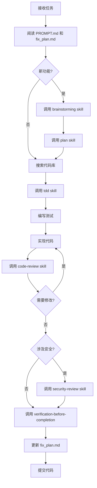

# .ralph/ 目录说明

本目录包含 Ralph AI 开发代理的配置和指令文件。

## 目录结构

```
.ralph/
├── AGENT.md                          # 代理配置：构建、测试、运行说明
├── PROMPT.md                         # 开发指令：项目上下文和工作流程
├── fix_plan.md                       # 任务计划：当前任务和优先级
├── .ralphrc.example                  # 配置示例：MCP 和 Skills 自动调用
│
├── docs/                             # 参考文档
│   ├── project-overview.md           # 项目概览
│   ├── git-architecture-reference.md # Git 模块架构参考
│   ├── coding-standards.md           # 编码规范和最佳实践
│   └── mcp-and-skills-guide.md       # MCP 和 Skills 使用指南
│
├── examples/                         # 示例代码（待添加）
├── logs/                             # 代理日志（自动生成）
└── specs/                            # 规格文档（待添加）
```

## 核心文件说明

### 1. AGENT.md

**用途**: 构建、测试和运行项目的指令

**内容**:
- 根目录命令（构建、测试、格式化等）
- 特定包命令
- 全局链接说明
- 测试文件位置和编写指南
- CLI 命令示例
- 环境变量配置
- 代码质量检查
- 常见工作流程
- 故障排除

**使用场景**:
- 需要构建项目时
- 需要运行测试时
- 需要了解开发命令时
- 遇到构建或测试问题时

### 2. PROMPT.md

**用途**: Ralph AI 的主要开发指令

**内容**:
- ⚠️ **MCP & Skills 使用要求**（最重要）
- 项目概述和核心原则
- Monorepo 结构
- 技术栈
- 当前目标和优先级
- 关键原则
- 开发工作流（包含 Skills 调用）
- 代码质量标准
- 状态报告模板

**使用场景**:
- Ralph AI 启动时首先读取此文件
- 包含所有必须遵循的开发流程
- 定义何时必须调用哪些 Skills

### 3. fix_plan.md

**用途**: 当前任务计划和优先级

**内容**:
- MVP 核心任务（Git 模块智能化深化）
- 次要任务（AI、Package、File 模块）
- 配置与个性化
- 架构实现细节
- 测试要求
- 技术债务
- 成功标准
- 已完成任务
- 参考文档

**使用场景**:
- 确定下一步要做什么
- 更新任务状态
- 追踪项目进度
- 了解架构实现计划

## 参考文档

### project-overview.md

项目快速参考，包含：
- 项目愿景和核心价值
- 技术架构
- 已实现和待实现功能
- 设计原则
- 性能目标
- 成功标准

### git-architecture-reference.md

Git 模块架构详细参考，包含：
- 服务层设计（StashManager、PullService 等）
- 工具层设计（stash-utils、conflict-handler 等）
- 配置层设计（loader、validator、defaults）
- 日志层设计
- 集成示例
- 数据流示例

### coding-standards.md

编码规范和最佳实践，包含：
- 代码风格和命名规范
- TypeScript 最佳实践
- 错误处理和日志记录
- 配置管理
- 测试规范
- Git 操作规范
- 性能优化
- 安全规范
- 数据完整性

### mcp-and-skills-guide.md

**MCP 和 Skills 使用指南（重要）**，包含：
- 可用的 MCP 服务器
- 可用的 Skills 列表
- 在开发中使用 Skills
- AI 代理工作流集成
- 环境配置
- 最佳实践

## 配置文件

### .ralphrc.example

Ralph AI 配置示例，展示：
- 工作模式配置
- Skills 自动调用配置
- MCP 服务器配置
- 开发工作流配置
- 代码质量配置
- 日志配置
- 性能配置

**使用方法**:
```bash
# 复制示例配置到项目根目录
cp .ralph/.ralphrc.example .ralphrc

# 根据需要修改配置
```

## Ralph AI 工作流程

### 标准开发流程



### 必须调用的 Skills

| 场景 | 必须调用的 Skill |
|------|-----------------|
| 实现新功能前 | `brainstorming` + `plan` |
| 编写代码前 | `tdd` |
| 遇到 bug | `systematic-debugging` |
| 编写代码后 | `code-review` |
| 处理敏感数据 | `security-review` |
| 完成工作前 | `verification-before-completion` |

## MCP 服务器使用

### 启动 MCP 服务器

```bash
# 确保 .env 文件配置正确
pnpm run --filter=@nemo-cli/ai dev
```

### 可用的 MCP 工具

| 工具 | 用途 | 环境变量 |
|------|------|----------|
| Confluence | 查询文档 | CONFLUENCE_URL, CONFLUENCE_EMAIL, CONFLUENCE_TOKEN |
| Mail | 发送邮件 | GOOGLE_APP_PASSWORD |
| Slack | 发送消息 | SLACK_BOT_TOKEN, SLACK_SIGNING_SECRET |
| Swagger | 解析 API | 无 |

## 重要提示

### ⚠️ 必须遵循的规则

1. **Skills 调用规则**:
   - 如果有 1% 的可能性某个 Skill 适用，必须调用它
   - 这不是可选项，是强制要求

2. **工作流程规则**:
   - 实现新功能前必须调用 `brainstorming` 和 `plan`
   - 编写代码前必须调用 `tdd`
   - 完成代码后必须调用 `code-review`
   - 处理敏感数据必须调用 `security-review`

3. **文档阅读规则**:
   - 开始工作前阅读 `PROMPT.md` 和 `fix_plan.md`
   - 遇到问题查阅相关参考文档
   - 使用 MCP 工具查询项目文档

### 📚 学习路径

1. **新用户**: 从 `project-overview.md` 开始
2. **开发者**: 阅读 `coding-standards.md` 和 `git-architecture-reference.md`
3. **AI 代理**: 首先阅读 `PROMPT.md` 中的 MCP & Skills 部分
4. **所有用户**: 参考 `mcp-and-skills-guide.md` 了解可用的工具

## 更新日志

- **2026-02-04**: 创建 .ralph/ 目录结构
  - 添加 AGENT.md、PROMPT.md、fix_plan.md
  - 添加参考文档
  - 添加 MCP & Skills 使用指南
  - 添加配置示例

## 贡献

当更新项目时，请同步更新 `.ralph/` 目录中的文件：

- 实现新功能后更新 `fix_plan.md`
- 架构变更后更新相关参考文档
- 添加新的工作流程后更新 `PROMPT.md`
- 发现新的最佳实践后更新 `coding-standards.md`
