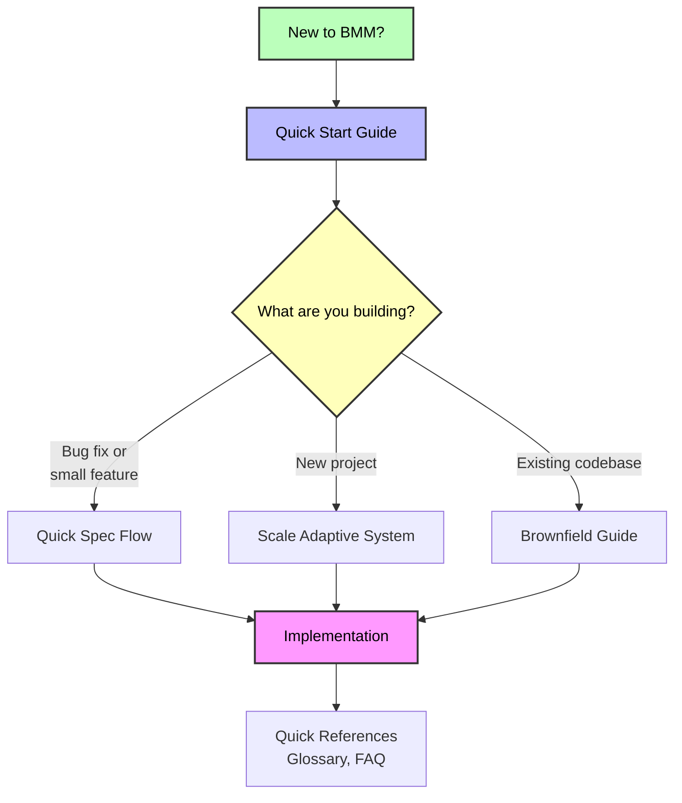

# BMM Documentation

Complete guides for the BMad Method Module (BMM) - AI-powered agile development workflows that adapt to your project's complexity.

---

## 🚀 Getting Started

**New to BMM?** Start here:

- **[Quick Start Guide](./quick-start.md)** - Step-by-step guide to building your first project (15 min read)
  - Installation and setup
  - Understanding the four phases
  - Running your first workflows
  - Agent-based development flow

**Quick Path:** Install → workflow-init → Follow agent guidance

### 📊 Visual Overview

**[Complete Workflow Diagram](./images/workflow-method-greenfield.svg)** - Visual flowchart showing all phases, agents (color-coded), and decision points for the BMad Method standard greenfield track.

---

## 📖 Core Concepts

Understanding how BMM adapts to your needs:

- **[Scale Adaptive System](./scale-adaptive-system.md)** - How BMM adapts to project size and complexity (42 min read)
  - Three planning tracks (Quick Flow, BMad Method, Enterprise Method)
  - Automatic track recommendation
  - Documentation requirements per track
  - Planning workflow routing

- **[Quick Spec Flow](./quick-spec-flow.md)** - Fast-track workflow for Quick Flow track (26 min read)
  - Bug fixes and small features
  - Rapid prototyping approach
  - Auto-detection of stack and patterns
  - Minutes to implementation

---

## 🤖 Agents and Collaboration

Complete guide to BMM's AI agent team:

- **[Agents Guide](./agents-guide.md)** - Comprehensive agent reference (45 min read)
  - 12 specialized BMM agents + BMad Master
  - Agent roles, workflows, and when to use them
  - Agent customization system
  - Best practices and common patterns

- **[Party Mode Guide](./party-mode.md)** - Multi-agent collaboration (20 min read)
  - How party mode works (19+ agents collaborate in real-time)
  - When to use it (strategic, creative, cross-functional, complex)
  - Example party compositions
  - Multi-module integration (BMM + CIS + BMB + custom)
  - Agent customization in party mode
  - Best practices

---

## 🔧 Working with Existing Code

Comprehensive guide for brownfield development:

- **[Brownfield Development Guide](./brownfield-guide.md)** - Complete guide for existing codebases (53 min read)
  - Documentation phase strategies
  - Track selection for brownfield
  - Integration with existing patterns
  - Phase-by-phase workflow guidance
  - Common scenarios

---

## 📚 Quick References

Essential reference materials:

- **[Glossary](./glossary.md)** - Key terminology and concepts
- **[FAQ](./faq.md)** - Frequently asked questions across all topics
- **[Enterprise Agentic Development](./enterprise-agentic-development.md)** - Team collaboration strategies

---

## 🎯 Choose Your Path

### I need to...

**Build something new (greenfield)**
→ Start with [Quick Start Guide](./quick-start.md)
→ Then review [Scale Adaptive System](./scale-adaptive-system.md) to understand tracks

**Fix a bug or add small feature**
→ Go directly to [Quick Spec Flow](./quick-spec-flow.md)

**Work with existing codebase (brownfield)**
→ Read [Brownfield Development Guide](./brownfield-guide.md)
→ Pay special attention to Phase 0 documentation requirements

**Understand planning tracks and methodology**
→ See [Scale Adaptive System](./scale-adaptive-system.md)

**Find specific commands or answers**
→ Check [FAQ](./faq.md)

---

## 📋 Workflow Guides

Comprehensive documentation for all BMM workflows organized by phase:

- **[Phase 1: Analysis Workflows](./workflows-analysis.md)** - Optional exploration and research workflows (595 lines)
  - brainstorm-project, product-brief, research, and more
  - When to use analysis workflows
  - Creative and strategic tools

- **[Phase 2: Planning Workflows](./workflows-planning.md)** - Scale-adaptive planning (967 lines)
  - prd, tech-spec, gdd, narrative, ux
  - Track-based planning approach (Quick Flow, BMad Method, Enterprise Method)
  - Which planning workflow to use

- **[Phase 3: Solutioning Workflows](./workflows-solutioning.md)** - Architecture and validation (638 lines)
  - architecture, create-epics-and-stories, implementation-readiness
  - V6: Epics created AFTER architecture for better quality
  - Required for BMad Method and Enterprise Method tracks
  - Preventing agent conflicts

- **[Phase 4: Implementation Workflows](./workflows-implementation.md)** - Sprint-based development (1,634 lines)
  - sprint-planning, create-story, dev-story, code-review
  - Complete story lifecycle
  - One-story-at-a-time discipline

- **[Testing & QA Workflows](./test-architecture.md)** - Comprehensive quality assurance (1,420 lines)
  - Test strategy, automation, quality gates
  - TEA agent and test healing
  - BMad-integrated vs standalone modes

**Total: 34 workflows documented across all phases**

### Advanced Workflow References

For detailed technical documentation on specific complex workflows:

- **[Document Project Workflow Reference](./workflow-document-project-reference.md)** - Technical deep-dive (445 lines)
  - v1.2.0 context-safe architecture
  - Scan levels, resumability, write-as-you-go
  - Multi-part project detection
  - Deep-dive mode for targeted analysis

- **[Architecture Workflow Reference](./workflow-architecture-reference.md)** - Decision architecture guide (320 lines)
  - Starter template intelligence
  - Novel pattern design
  - Implementation patterns for agent consistency
  - Adaptive facilitation approach

---

## 🧪 Testing and Quality

Quality assurance guidance:

<!-- Test Architect documentation to be added -->

- Test design workflows
- Quality gates
- Risk assessment
- NFR validation

---

## 🏗️ Module Structure

Understanding BMM components:

- **[BMM Module README](../README.md)** - Overview of module structure
  - Agent roster and roles
  - Workflow organization
  - Teams and collaboration
  - Best practices

---

## 🌐 External Resources

### Community and Support

- **[Discord Community](https://discord.gg/gk8jAdXWmj)** - Get help from the community (#general-dev, #bugs-issues)
- **[GitHub Issues](https://github.com/bmad-code-org/BMAD-METHOD/issues)** - Report bugs or request features
- **[YouTube Channel](https://www.youtube.com/@BMadCode)** - Video tutorials and walkthroughs

### Additional Documentation

- **[IDE Setup Guides](../../../docs/ide-info/)** - Configure your development environment
  - Claude Code
  - Cursor
  - Windsurf
  - VS Code
  - Other IDEs

---

## 📊 Documentation Map

---

## 💡 Tips for Using This Documentation

1. **Start with Quick Start** if you're new - it provides the essential foundation
2. **Use the FAQ** to find quick answers without reading entire guides
3. **Bookmark Glossary** for terminology references while reading other docs
4. **Follow the suggested paths** above based on your specific situation
5. **Join Discord** for interactive help and community insights

---

**Ready to begin?** → [Start with the Quick Start Guide](./quick-start.md)
